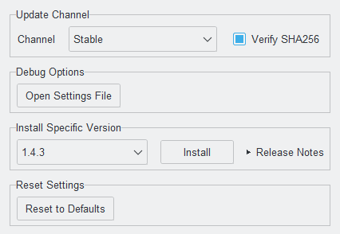

# Contributing

This is mostly a maintenance note for future me: how to set up the project, run the checks, update translations, build installers, and cut releases. It should also be enough for anyone else who wants to work on the repo.

## Development setup

The project requires Python `>=3.14,<3.15` and uses [`uv`](https://docs.astral.sh/uv/) for dependency management.

On Windows PowerShell:

```powershell
winget install --id Astral-sh.uv -e
uv python install 3.14
git clone https://github.com/jonalbr/heat-sheet-pdf-highlighter.git
cd heat-sheet-pdf-highlighter
uv sync --all-groups
uv run python main.py
```

Windows is the primary development and build path. Do not share the same `.venv` between Windows and WSL. If you use the same checkout from WSL, set `UV_PROJECT_ENVIRONMENT=.venv-wsl`.

## Common commands

```powershell
uv sync --all-groups
uv run python main.py
uv run pytest
uv run ruff check .
uv run ruff check . --fix
uv run ruff format .
uv run cmd /c build.bat
```

## Working on a change

1. Create a focused branch.
2. Make the smallest coherent change that solves the problem.
3. Add or update tests when behavior changes.
4. Run `uv run pytest` and `uv run ruff check .`.
5. Update translations when you add visible UI text.
6. If the change is going through GitHub review, open a pull request with a clear description and any user-visible effect.

### Code guidelines

- Follow the existing module boundaries: `src/gui`, `src/core`, `src/config`, and `src/utils`.
- Keep visible GUI strings centralized in `src/gui/ui_strings.py`.
- Use `AppSettings` for persisted settings and keep existing settings-key conventions intact.
- Do not update Tkinter widgets directly from worker threads. Use the existing Tk scheduling patterns instead.
- Keep changes small and explicit, especially around updater, installer, release, and localization behavior.

Where changes usually belong:

- GUI components: `src/gui/`
- Business logic: `src/core/`
- Reusable utilities: `src/utils/`
- Application constants: `src/constants.py`
- Persisted configuration: `src/config/settings.py`

## Internationalization

The app currently ships English and German translations. Translation helpers live in `locales/`, and the extraction workflow intentionally scans `src/gui/ui_strings.py`.

The detailed localization workflow lives in:

- [locales/README.md](locales/README.md)

Typical interactive update:

```powershell
cd locales
.\update_translation_files_interactive.bat
```

If you manually edit `.po` files, compile them afterward:

```powershell
cd locales
.\update_mo_files.bat
```

## Debug logging

Normal runs do not write a log file. When debugging from source, pass one explicitly:

```powershell
uv run python main.py --log-level DEBUG --log-file C:\temp\app.log
```

`LOG_LEVEL` and `LOG_FILE` provide the same options through environment variables. Without a log file, source runs log to stderr.

## Dev Tools

Open the Dev Tools window by triple-clicking the app logo in the top-left corner of the main window. It exposes update-channel controls, release inspection, and update-testing helpers.

<picture>
  <source media="(prefers-color-scheme: dark)" srcset="images/app_screenshot_devtools_dark.png">
  <source media="(prefers-color-scheme: light)" srcset="images/app_screenshot_devtools_light.png">
  
</picture>

## Building the Windows installer

The Windows build uses `cx_Freeze` and [Inno Setup](https://jrsoftware.org/isdl.php). `build.bat` looks for Inno Setup 6 in the standard install locations:

```text
C:\Program Files (x86)\Inno Setup 6\ISCC.exe
C:\Program Files\Inno Setup 6\ISCC.exe
```

If you installed Inno Setup somewhere nonstandard, update `build.bat` before building.

Create a local `.env` file in the project root:

```text
AppId={{Your_AppId}}
```

Use your own GUID for local builds and never commit `.env`.

### Local installers vs official releases

The steps above are enough to build your own local installer. A custom `AppId` gives that installer its own Windows identity, so it is not treated as an update to the official app.

The official `AppId` is intentionally private. Update-compatible official installers can only be produced by the maintainer or by the repository release workflow with access to the GitHub Actions secret `INNO_APP_ID`.

Build locally with:

```powershell
uv run cmd /c build.bat
```

Expected build outputs:

- `cx_build/heat_sheet_pdf_highlighter.exe`
- `heat_sheet_pdf_highlighter_installer.exe`
- `heat_sheet_pdf_highlighter_installer.exe.sha256`
- `cx_freeze.log`

Optional code-signing settings can also be supplied through environment variables, but they are not required for a local build.

## Release helper

`create_release.py` updates version metadata, captures documentation screenshots, refreshes `uv.lock`, and creates a signed release tag for the GitHub Actions release workflow.

```powershell
# Real release flow: update versions, commit if needed, push, tag, and publish via CI
uv run python create_release.py 1.4.0

# Local-only build: temporarily update versions, build, capture screenshots, then revert version files
uv run python create_release.py 1.4.0 --local

# Dry run of the local version-update flow without building
uv run python create_release.py 1.4.0 --local --no-build
```

Notes:

- Supported release versions are `X.Y.Z` and `X.Y.Z-rcN`.
- Local flow temporarily sets `HSPH_SKIP_BUILD_PAUSE=true` so `build.bat` does not wait for prompts.

### Official release path

- Tag pushes matching `v*` trigger `.github/workflows/ci.yml`.
- The GitHub Actions workflow validates release metadata, runs tests, builds the installer with the private `INNO_APP_ID` secret, uploads the installer and checksum, and publishes the GitHub Release.
- Tags containing `-rc` are published as prereleases.

## Verifying installer checksums

Each release includes `heat_sheet_pdf_highlighter_installer.exe.sha256`.

On Windows PowerShell:

```powershell
Get-FileHash .\heat_sheet_pdf_highlighter_installer.exe -Algorithm SHA256
Get-Content .\heat_sheet_pdf_highlighter_installer.exe.sha256
```

The hashes must match exactly.
