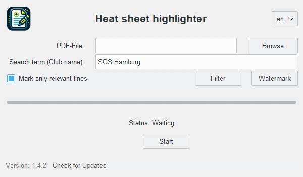

# Heat Sheet PDF Highlighter

[](https://www.codefactor.io/repository/github/jonalbr/heat-sheet-pdf-highlighter)

## Overview
Heat Sheet PDF Highlighter is a Python application designed to facilitate the highlighting of heat sheets in PDF format. This tool is especially useful for individuals and organizations needing to annotate and highlight structured documents like event line-ups or timetables in a standardized PDF format.



## Features
- **Smart PDF Highlighting:** Automatically highlight lines containing search terms with intelligent format detection
- **Flexible Search Options:**
  - Search by club name or any custom term
  - Option to highlight only relevant lines (matching expected format: Lane Name ... Time)
  - Filter mode for highlighting specific names only
- **Advanced Filtering System:**
  - **Name-based filtering:** Highlight only lines containing specific names
  - **Two highlighting modes:**
    - **Names Only:** Highlight matched names in blue, ignore others
    - **Differential Colors:** Highlight matched names in blue, others in yellow
  - **Bulk name import:** Import names from CSV or text files
  - **Smart name parsing:** Supports comma-separated and newline-separated formats
- **Watermark System:**
  - **Live preview:** See watermark changes in real-time and on different pages
  - **Customizable text, color, size, and position**
- **Professional GUI:**
  - **Progress tracking:** Real-time processing status and progress bar
  - **Persistent settings:** Language, search terms, and preferences saved between sessions
- **Localization:** Full support for English and German languages
- **Auto-updater:** Check for and install updates directly from the application
- **Cross-platform compatibility:** Works on Windows, macOS (untested), and Linux (untested) (EXE installer Windows-only)

## Installation

### Installation via EXE (Windows)
**Recommended for end users**

1. Download the latest release installer from the [releases page](https://github.com/jonalbr/heat-sheet-pdf-highlighter/releases).
2. Locate the downloaded `.exe` file and double-click on it to start the installation process.
3. **Important Security Notice:** Windows may show a security warning since the executable is not digitally signed. If Windows Defender SmartScreen appears:
   - Click on **"More info"**
   - Then click **"Run anyway"**
   - This is normal for unsigned applications and safe to proceed
4. Follow the on-screen instructions to complete the installation.
5. Once installed, launch the application by searching for "Heat Sheet PDF Highlighter" in the Start menu or using the desktop shortcut.

### (Optional) Verify installer checksum
To verify the integrity of the downloaded installer, compare its SHA-256 hash with the checksum file provided alongside the release (`.exe.sha256`):

1. Download the corresponding `.sha256` file from the same release.
2. On Windows (PowerShell), compute the hash of your downloaded installer and compare it with the contents of the `.sha256` file.
3. The hashes must match exactly; if they don't, re-download the installer.

**Note:** The .exe installer is only available for Windows operating systems. For other platforms, use the Python script method below.

### Run from Source Code
**For developers and advanced users**

#### Prerequisites
- Python 3.13 or higher
- Windows, macOS (untested), or Linux (untested)

#### Setup Instructions
To run Heat Sheet PDF Highlighter directly from source code:

1. **Clone the repository:**
   ```bash
   git clone https://github.com/jonalbr/heat-sheet-pdf-highlighter.git
   cd heat-sheet-pdf-highlighter
   ```

2. **Create and activate a virtual environment (recommended):**
   If you are planning to develop, please read [Development Setup](#development-setup).
    
   ```bash
   python -m venv .venv
   # On Windows:
   .venv\Scripts\activate
   # On macOS/Linux:
   source .venv/bin/activate
   pip install -r requirements.txt
   ```

4. **Launch the application:**
   ```bash
   python main.py
   ```

#### Dependencies
The application requires these core libraries:
- **PyMuPDF (pymupdf)** - PDF processing and manipulation
- **Pillow (PIL)** - Image processing for GUI and watermarks  
- **Requests** - HTTP requests for update checking
- **Tkinter** - GUI framework (included with Python)

All dependencies are automatically installed via `requirements.txt`.

## Usage

### Basic Workflow

After launching the application (either via the installed executable or Python script):

1. **Select PDF File:** Click **"Browse"** to select a PDF file you want to highlight
2. **Enter Search Term:** Type your search term (e.g., club name) in the text field
3. **Configure Basic Options:**
   - **"Mark only relevant lines"** (recommended): Only highlights lines matching the expected format (Lane Name ... Time)
4. **Process:** Click **"Start"** to generate the highlighted PDF

The processed PDF will be saved with "_highlighted" suffix in your chosen location.

### Advanced Features

#### Name Filtering
Click the **"Filter"** button to access advanced name-based highlighting:

- **Enable Filter:** Toggle name-based filtering on/off
- **Name List:** Enter specific names to highlight (comma-separated)
- **Import Names:** Load names from CSV or text files
- **Highlighting Modes:**
  - **Names Only:** Highlight only lines with matched names (blue)
  - **Differential Colors:** Highlight matched names (blue) and others (yellow)

#### Watermark System
Click the **"Watermark"** button to add custom watermarks:

- **Enable Watermark:** Toggle watermark on/off
- **Watermark Text:** Custom text to overlay on pages
- **Color Selection:** Choose from presets or enter custom hex colors
- **Size Control:** Adjust watermark size
- **Position:** Place watermark at top or bottom of pages
- **Live Preview:** See changes in real-time on different PDF pages

#### Settings Persistence
All your preferences are automatically saved:
- Language selection
- Last search term
- Filter settings and names
- Watermark configuration
- Window preferences


# Development

## Development Setup

1. **Clone and setup virtual environment (recommended):**
   ```bash
   git clone https://github.com/jonalbr/heat-sheet-pdf-highlighter.git
   cd heat-sheet-pdf-highlighter
   python -m venv .venv
   .venv\Scripts\activate  # Windows
   # source .venv/bin/activate  # macOS/Linux
   pip install -r requirements_build.txt
   ```

2. **Run:**
   ```bash
   python main.py
   ```

**Note:** Use `requirements_build.txt` for development as it includes all dependencies needed for both running and building the application. The `requirements.txt` file contains only the minimal runtime dependencies for end users.

## Internationalization (i18n)

The application supports multiple languages (currently English and German). Translation management is handled through GNU gettext.

### Setting up gettext Tools

Install `gettext` with `msys2` and ensure the paths in the update `.bat` scripts are correct:

1. **Install msys2:** Download the installer from [https://www.msys2.org/](https://www.msys2.org/) and follow the installation instructions.

2. **Open the MSYS2 MSYS terminal** from the start menu.

3. **Update the package database:**
   ```bash
   pacman -Syu
   ```
   If needed, close and reopen the MSYS2 terminal.

4. **Install gettext:**
   ```bash
   pacman -S gettext
   ```

5. **Verify installation:** The tools should be available at `C:\msys64\usr\bin\` with commands `xgettext`, `msgmerge`, `msginit`, and `msgfmt`.

6. **Update paths if needed:** If installed elsewhere, modify the paths in `locales\update_translation_files.bat` and `locales\update_mo_files.bat`:
   ```bat
   set XGETTEXT_PATH=C:\msys64\usr\bin\xgettext.exe
   set MSGMERGE_PATH=C:\msys64\usr\bin\msgmerge.exe
   set MSGINIT_PATH=C:\msys64\usr\bin\msginit.exe
   set MSGFMT_PATH=C:\msys64\usr\bin\msgfmt.exe
   ```

### Translation Workflow

**For updating translations after code changes:**

1. **Navigate to locales directory:**
   ```bash
   cd locales
   ```

2. **Update translation files:**
   ```bash
   ./update_translation_files.bat
   ```
   This script will:
   - Extract translatable strings from source code
   - Update existing `.po` files with new strings
   - Prompt for German translations of changed strings
   - Auto-fill English `.po` files (since English is the development language)
   - Compile `.mo` files for runtime use

**For manual `.po` file changes:**

If you manually edit `.po` files, compile them to `.mo` files:
```bash
cd locales
./update_mo_files.bat
```

## Logging

The application provides a minimal, logging configuration by default so library and internal warnings are visible when running from source.

You can customize logging via environment variables or command-line flags (CLI overrides env):

- Environment variables:
   - `LOG_LEVEL` — log level name (DEBUG, INFO, WARNING, ERROR) or numeric value.
   - `LOG_FILE` — path to a file to append logs to. If not set, logs go to stderr.

- CLI flags (pass to `python main.py`):
   - `--log-level LEVEL` — same values as `LOG_LEVEL`.
   - `--log-file PATH` — path to log file (overrides `LOG_FILE`).

Examples (PowerShell):

```powershell
$env:LOG_LEVEL = 'DEBUG'
$env:LOG_FILE = 'C:\temp\app.log'
& .venv\Scripts\python.exe main.py
```

Or override via CLI:

```powershell
& .venv\Scripts\python.exe main.py --log-level INFO --log-file C:\temp\cli.log
```

For programmatic usage in code or tests, import the logging helpers:

```python
from src.utils import logging as app_logging

app_logging.configure_basic_logging()
```


## Building Executable

To build the application for Windows deployment as an installer.

**Note:** Due to security reasons, the AppId is not public. You cannot create executables that will be recognized as official updates without access to the private signing key.

### Prerequisites

**Inno Setup:** Download and install from [jrsoftware.org](https://jrsoftware.org/isdl.php). The build script expects it at:
   ```
   C:\Program Files (x86)\Inno Setup 6\ISCC.exe
   ```
   If installed elsewhere, update the path in `build.bat`.

### Environment Configuration

Create a `.env` file in the project root:
```
AppId={{Your_AppId}}
```
Replace `{Your_AppId}` with a GUID (format: `{12345678-1234-1234-1234-123456789012}`). The two `{{` are not a mistake. Example: `AppId={{12345678-1234-1234-1234-123456789012}}`

**Important:** Do not share your `.env` file as it now contains sensitive information!

### Build Process

1. **Create and activate virtual environment (recommended), if not done yet:**
   See [Development Setup](#development-setup) for details.
   
   This ensures a clean build without unnecessary packages that would increase executable size.

2. **Run the build script:**
   ```bash
   ./build.bat
   ```

The build script will:
- Use cx_Freeze to compile the Python application to an executable
- Create an installer using Inno Setup
- Output the final installer as `heat_sheet_pdf_highlighter_installer.exe`

### Build Output

- **Executable:** `cx_build/heat_sheet_pdf_highlighter.exe`
- **Installer:** `heat_sheet_pdf_highlighter_installer.exe`
- **Build log:** `cx_freeze.log`

### Virtual Environment Benefits

Using a virtual environment for building:
- **Reduces executable size** by excluding unnecessary packages
- **Ensures clean dependencies** matching `requirements_build.txt`
- **Prevents conflicts** with your global Python environment
- **Provides reproducible builds**


## Contributing

Contributions are welcome! Here's how to get started:

### Development Workflow

1. **Fork the repository** and clone your fork
2. **Create a feature branch:** `git checkout -b feature-name`
3. **Set up development environment:**
   See [Development Setup](#development-setup) for details.
4. **Make your changes** following the project structure
5. **Test your changes:** Run `python main.py` to verify functionality
6. **Update translations** if you added new UI strings:
   ```bash
   cd locales
   ./update_translation_files.bat
   ```
7. **Commit and push** your changes
8. **Submit a pull request** with a clear description

### Code Style

- Follow Python PEP 8 style guidelines
- Use meaningful variable and function names
- Add docstrings for new modules and functions
- Maintain the modular structure in `src/`

### Adding New Features

- Place GUI components in `src/gui/`
- Add business logic to `src/core/`
- Use `src/utils/` for reusable utilities
- Update `src/constants.py` for new application constants
- Add configuration options to `src/config/settings.py`

Feel free to open issues for bug reports, feature requests, or questions about the codebase.

## Release helper script

The repository includes a small release helper `create_release.py` used to update
version strings, run the local build, and create a signed git tag for releases.

Usage:

```powershell
# Update versions, build, tag and push (regular release flow)
py .\create_release.py 1.4.0

# Local-only: temporarily update versions, run build, then revert local files
py .\create_release.py 1.4.0 --local

# Dry-run local: update+revert without running the build (quick test)
py .\create_release.py 1.4.0 --local --no-build
```

Notes:
- `--local` updates `setup.py`, `setup.iss`, and `src/constants.py` with the
   provided version, runs the repository `build.bat`, then restores the files to
   their original content so your working tree is unchanged.
- `--no-build` is a dry-run helper that skips the actual build step (useful for
   testing the update+revert behavior or other local checks without running the
   build).
- The script temporarily sets `GITHUB_ACTIONS=true` during local builds so the
   build batch script won't pause for interactive prompts. This is only set for
   the lifetime of the local operation and restored afterward.

Security / safety:
- The local flow intentionally does not create commits, tags, or pushes. Use the
   default (no `--local`) mode to perform the real release which will try to
   commit staged changes and create a signed tag to push.

## License

This project is licensed under the GNU General Public License v3.0 - see the [LICENSE](LICENSE) file for details.
