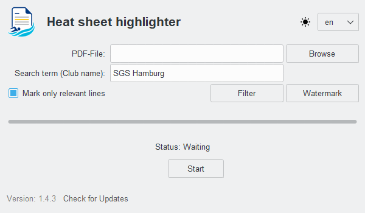
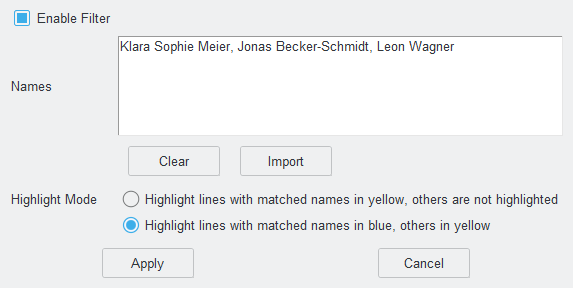
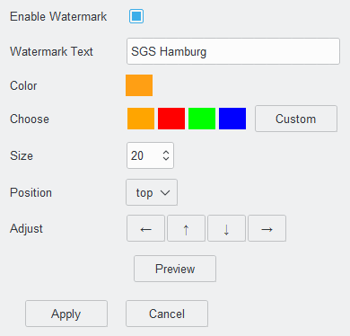

<div align="center">
  

  <h1>Heat Sheet PDF Highlighter</h1>

  <p>Highlight heat-sheet PDFs by club, swimmer name, or custom search term.</p>

  <p>
    <a href="https://github.com/jonalbr/heat-sheet-pdf-highlighter/releases/latest">
      
    </a>
    <a href="https://www.codefactor.io/repository/github/jonalbr/heat-sheet-pdf-highlighter">
      
    </a>
    <a href="LICENSE">
      
    </a>
  </p>

  <p>
    <a href="https://github.com/jonalbr/heat-sheet-pdf-highlighter/releases/latest/download/heat_sheet_pdf_highlighter_installer.exe">
      
    </a>
  </p>
</div>

<p align="center">
  <picture>
    <source media="(prefers-color-scheme: dark)" srcset="images/app_screenshot_dark.png">
    <source media="(prefers-color-scheme: light)" srcset="images/app_screenshot_light.png">
    
  </picture>
</p>

## What it does

Heat Sheet PDF Highlighter is a small desktop app for marking the rows that matter in heat-sheet PDFs. It highlights by club or search term, can narrow the result to specific swimmers, and can add a watermark before writing a new PDF.

The packaged installer is Windows-only. Running from source on macOS or Linux may work, but those platforms are currently untested.

## Install

### Windows installer

1. [Download the latest installer](https://github.com/jonalbr/heat-sheet-pdf-highlighter/releases/latest/download/heat_sheet_pdf_highlighter_installer.exe).
2. Run the downloaded `.exe`.
3. If Windows SmartScreen appears for the unsigned installer, choose **More info** → **Run anyway**.
4. Launch **Heat Sheet PDF Highlighter** from the Start menu or desktop shortcut.

You can also browse all versions on the [releases page](https://github.com/jonalbr/heat-sheet-pdf-highlighter/releases).

## Quick start

1. Click **Browse** and choose a heat-sheet PDF.
2. Enter a club name or other search term.
3. Leave **Mark only relevant lines** enabled when you only want rows that match the expected heat-sheet layout.
4. Click **Start** and save the generated highlighted PDF.

The app saves a new PDF with a `_highlighted` suffix at the location you choose.

## Features

- Highlight rows by club name or custom search term
- Limit highlighting to specific swimmers and choose between:
  - **Names Only:** highlight matching names in blue
  - **Differential Colors:** highlight matching names in blue and other matches in yellow
- Import names from CSV or text files. Comma-separated and newline-separated lists are parsed automatically.
- Preview and place watermarks with preset or custom colors, size controls, and nudgeable positioning
- Use system, light, or dark theme. System mode follows Windows appearance changes.
- Track processing progress while the PDF is being generated
- Keep language, search, filter, watermark, and window preferences between sessions
- Switch between English and German
- Check for and install updates from inside the app on Windows

## Screenshots

Filter dialog:

<picture>
  <source media="(prefers-color-scheme: dark)" srcset="images/app_screenshot_filter_dark.png">
  <source media="(prefers-color-scheme: light)" srcset="images/app_screenshot_filter_light.png">
  
</picture>

Watermark dialog:

<picture>
  <source media="(prefers-color-scheme: dark)" srcset="images/app_screenshot_watermark_dark.png">
  <source media="(prefers-color-scheme: light)" srcset="images/app_screenshot_watermark_light.png">
  
</picture>

## Run from source

To run from source, install Python 3.14 and [`uv`](https://docs.astral.sh/uv/), then:

```powershell
git clone https://github.com/jonalbr/heat-sheet-pdf-highlighter.git
cd heat-sheet-pdf-highlighter
uv sync --all-groups
uv run python main.py
```

This project requires Python `>=3.14,<3.15`.

## Contributing

Development setup, translations, builds, releases, checksum verification, and Dev Tools are documented in [CONTRIBUTING.md](CONTRIBUTING.md).

## License

This project is licensed under the GNU General Public License v3.0. See [LICENSE](LICENSE).
